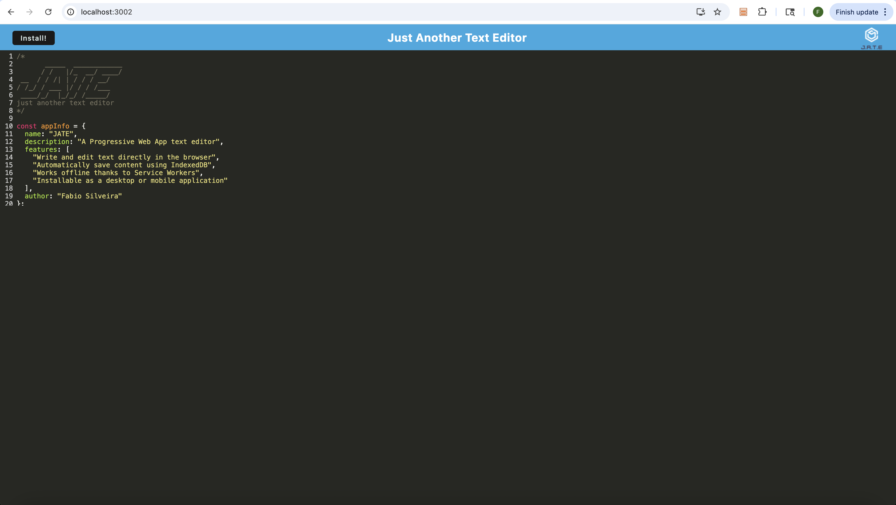

# PWA Text Editor

## Description

This project is a Progressive Web Application (PWA) text editor that runs in the browser and allows users to create and save notes both online and offline.

The application demonstrates core PWA concepts such as service workers, asset caching, and offline data persistence. Users can write and edit text in the editor, and the content is automatically saved using IndexedDB. Even if the browser is refreshed or the application is reopened later, the content remains available.

The app can also be installed on a user's device as a desktop-like application, providing a more native experience.

This project was built to practice modern web development concepts including Progressive Web Apps, offline functionality, and client-server architecture.

---

## Features

- Write and edit text directly in the browser
- Automatic content saving
- Offline functionality using service workers
- Persistent storage with IndexedDB
- Installable as a Progressive Web App
- Asset caching for faster load times

---

## Tech Stack

Frontend
- JavaScript (ES6+)
- HTML
- CSS

Backend
- Node.js
- Express

Tools & Technologies
- Webpack
- Babel
- Workbox
- IndexedDB
- idb
- Service Workers

---

## Screenshots



---

## Installation

Clone the repository and run the application locally:

```bash
# Clone the repository
git clone https://github.com/fabioesilveira/PWA-Text-Editor.git

# Navigate to the project directory
cd PWA-Text-Editor

# Install dependencies
npm install

# Build the client
npm run build

# Start the server
npm start
```

The application will run at: http://localhost:3002